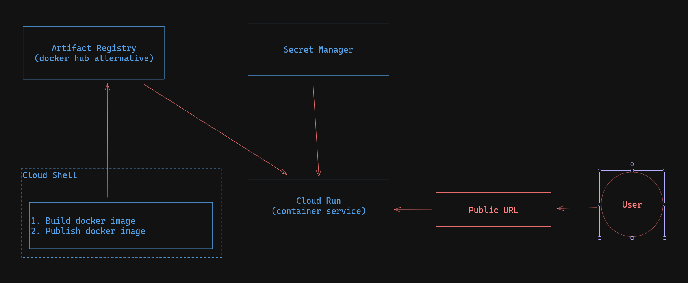

## Prepare GCP project
1. enable required APIs
    -  Cloud Run API (`run.googleapis.com`) allows to run docker containers as a service
    -  Compute Engine API (`compute.googleapis.com`) allows to use compute services & resources
    -  Secret Manager API (`secretmanager.googleapis.com`) allows to store sensitive information & attach to the supported services
    -  Artifact Registry API (`artifactregistry.googleapis.com`) allows to store docker image(s)

APIs can be enalbed using [UI](https://console.cloud.google.com/apis/library) or `gcloud` command:
```bash
gcloud services enable \
    run.googleapis.com \
    compute.googleapis.com \
    secretmanager.googleapis.com \
    artifactregistry.googleapis.com
```

## Create artifact registry docker repository
1. Navigate to the [artifact registry](https://console.cloud.google.com/artifacts)
2. Click on "Create Respository"
3. Populate the following fields
    - `name` indicates the repostiroy name
    - `region` indicates where the image is hosted
    - *leave other fields intact*
4. Click on "Create"

5. Navigate to the newly created repository
6. Click on the "Setup Instructions"
    - Copy the setup command & save for later use
7. Copy the repository URL (*from top of the page, next to the repository name*) & save for later use

## Prepare docker image
1. Open Google Cloud Shell
2. Clone the project from the git repository
    - Using the command `git clone <repo_link>`
3. Change directory to the project directory
    - Using the command `cd <project_directory>`
4. Build the docker image
    - Using the command `docker buld -f docker/Dockerfile -t <image_name>/<project_name>:<tag> .`
    - *Replace `<image_name>` with the repository URL from the [Create artifact registry docker repository](#create-artifact-registry-docker-repository)] step 7*
    - *Replace `<project_name>` with desired project name*
    - *Replace `<tag>` with desired tag (`latest` for example)*
5. Push the docker image
    - Using the command `docker push <image_name>/<image_name>/<project_name>:<tag>`
    - *Do the same replacements as in the previous step*

## Create Cloud Run service
1. Navigate to the [Cloud Run](https://console.cloud.google.com/run)
2. Click on "Create Service"
3. Populate the following fields
    - In `Deploy one revision from an existing container image` select the image built in the [Prepare docker image](#prepare-docker-image) section
    - `Service name` indicates the service name
    - `Maximum number of instances` indicates the maximum number of applications to run in parallel, when application load increases
    - `Allow unauthenticated invocations` indicates whether to allow unauthenticated invocations
    - `Container(s) / Container port` indicates the port of the container
    - `Container(s) / Environment variables` indicates the environment variables to pass to the container
    - `Container(s) / Secrets exposed as environment variables` indicates the secrets to pass to the container
    - *leave other fields intact*
4. Click on "Create"
5. Once the service & revision is created, the service URL will be avilable for further use

## Notes
1. In case it is required to attach secret to the Cloud Run service
    - Navigate to the [IAM & Admin](https://console.cloud.google.com/iam-admin)
    - Identify the Cloud Run service service account
    - Edit
    - Add role `Secret Manager Secret Accessor`
    - Click "Save"
2. Do not forget to enable network access to the dependent services
    - MongoDB Atlas
    - Redis
